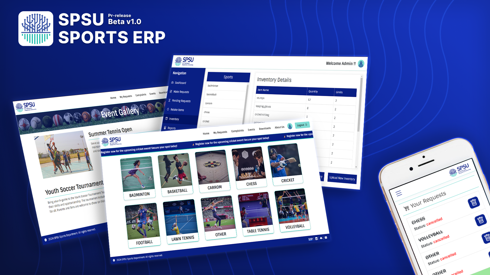

# SPSU Sports ERP DevDoc

Welcome to the comprehensive guide for **SPSU Sports ERP**! Here, you'll find all the documentation, version updates, and resources needed to build, manage, and enhance your sports management system 🏅. Stay informed with the latest features, and dive into our API docs and guides! 🚀

- **Latest Stable Version:** v1.3.1
- **Last Updated On:** October 12, 2024

## Core Team - Tech Geeks

- **Lead Developer:** [@self-nasu](https://www.github.com/self-nasu)  
  - Oversees the development process  
  - Ensures alignment with project vision  
  - Solves complex technical challenges  
  - Mentors team members  

- **Database and API Specialist:** [@self-Puneet](https://github.com/self-Puneet)  
  - Designs and manages database architecture  
  - Ensures optimal data storage and retrieval  
  - Develops and maintains APIs  
  - Facilitates seamless front-end and back-end communication  

- **UI/UX Designer:** [@self-yash](https://www.github.com/self-yash)  
  - Creates intuitive user interface 
  - Conducts user research and usability testing  
  - Ensures visual appeal and user-friendliness  
  - Enhances overall user experience  

- **Developer:** [@self-Lakshh](https://github.com/Self-Lakshh)  
  - Implements application features and functionalities  
  - Collaborates with the lead developer on coding standards  
  - Translates design concepts into functional components  
  - Contributes to a cohesive development process  

## Tech Stack

| **Category**           | **Technology**                                   |
|-----------------------|--------------------------------------------------|
| **Front-End**         | HTML5, CSS3, JavaScript, Bootstrap 5, Animate.css |
| **Back-End**          | Node.js (Serverless Functions), Python (Custom API) |
| **Database**          | Firebase (Firestore DB)                          |
| **Hosting**           | Netlify                                         |
| **CI/CD**             | GitHub CI/CD Workflow, GitHub Actions Pipelines |
| **Mailing**           | EmailJS                                         |
| **Backup**            | Cloud Backups                                   |
| **User Authentication**| Firebase User Auth                             |
| **Security**          | DDoS Protection Layers, Unknown Login Prevention  |

## Beta Testing Summary

- **Beta Version:** v1.0.0  
- **Testing Period:** September 6, 2024 – October 6, 2024  
- **Overview:** During the one-month testing phase, the beta version received **123 user requests** and saw over **200 user sign-ups**. It generated a total of **1.3 million reads** and **130,000 writes**, with the application being **loaded over 9,000 times**.
